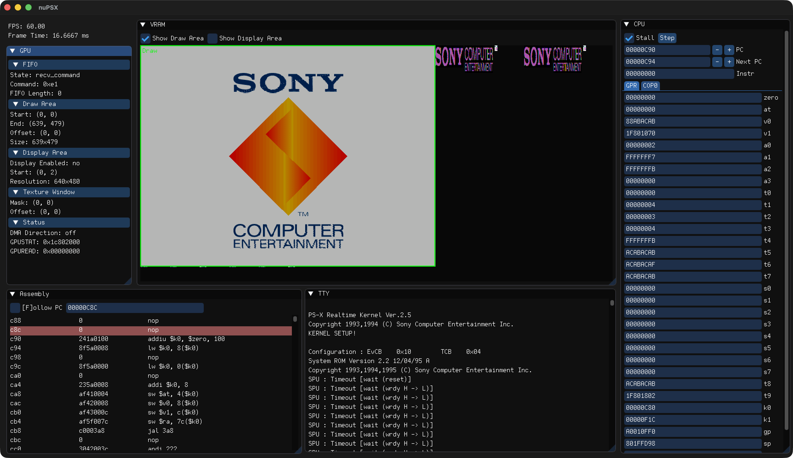

# nuPSX



nuPSX is an experimental PlayStation 1 emulator and debugger written in Zig, built as a learning exercise to explore Zig's capabilities and PSX hardware architecture.

Still in early development with no intention of becoming usable by the general bublic. If you are looking for the emulator to play games, check out DuckStation or PCSX-Redux.

> Built using [zig-gamedev](https://github.com/zig-gamedev)—a collection of high quality idiomatic wrappers for graphics and audio APIs like WebGPU, OpenGL, SDL, ImGui, and more.

## State

Can load into BIOS :)

## Running

```
git clone https://github.com/maxpoletaev/nupsx.git
cd nupsx
zig build --release=fast
./zig-out/bin/nupsx --bios SCPH1001.bin
```

## Command Line Options

```
nuPSX - A PlayStation emulator

Usage: nupsx --bios <path> [options]

Options:
  --bios <path>        Path to BIOS file (required)
  --exe <path>         Path to executable file to run
  --cdrom <path>       Path to CD-ROM image file (.cue)
  --debug-ui           Enable debug user interface
  --disasm             Enable disassembly output
  --breakpoint <addr>  Set a breakpoint at the specified address (hexadecimal)
  -h, --help           Show this help message
```

## Controls

```
    [ Q ]                      [ O ]
  _/[ E ]\_                  _/[ U ]\_
 /         \----------------/         \
|    [W]    |              |    [I]    |
| [A]   [D] |              | [J]   [L] |
|    [S]    | [ENT] [R-SH] |    [K]    |
|\_________/----------------\_________/|
|       /                      \       |
|      /                        \      |
 \____/                          \____/

  ↑ = W     △ = I     [START]  = Enter
  ← = A     ◻ = J     [SELECT] = RShift
  ↓ = S     × = K     [L1] = E  [R1] = U
  → = D     ◯ = L     [L2] = Q  [R2] = O
````

## References

> Special thanks to [EmuDev Discord](https://discord.gg/dkmJAes) which has accumulated a lot of undocumented knowledge and got me unstuck multiple times.

**Readings:**
 * [PSX-SPX Playstation Specifications](https://problemkaputt.de/psx-spx.htm) by Martin "nocash" Korth 
 * [PlayStation Emulation](https://jsgroth.dev/blog/posts/ps1-cpu/) blog post series by James Groth
 * [PlayStation Emulation Guide](https://github.com/simias/psx-guide) ([PDF](https://github.com/simias/psx-guide/issues/4#issuecomment-181339467)) by Lionel "simias" Flandrin
 * [The PS1 GPU texture pipeline and how to emulate it](https://www.reddit.com/r/EmuDev/comments/fmhtcn/article_the_ps1_gpu_texture_pipeline_and_how_to/) reddit post by an unknown author

**Tests and Demos:**
 * https://psx.amidog.se/doku.php
 * https://github.com/PeterLemon/PSX
 * https://github.com/JaCzekanski/ps1-tests

**Referenced Projects:**
 * https://github.com/allkern/psxe
 * https://github.com/stenzek/duckstation
 * https://github.com/JaCzekanski/Avocado

