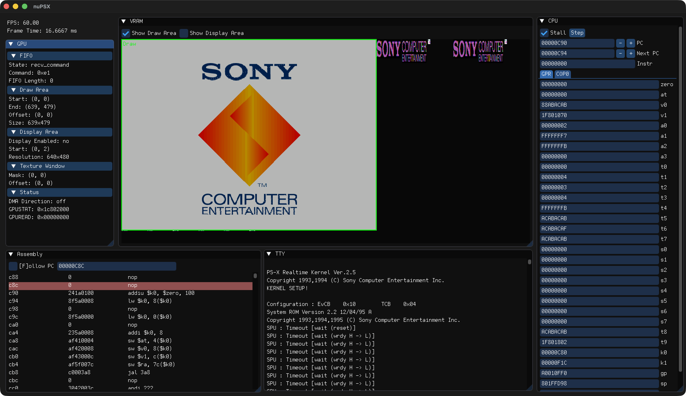
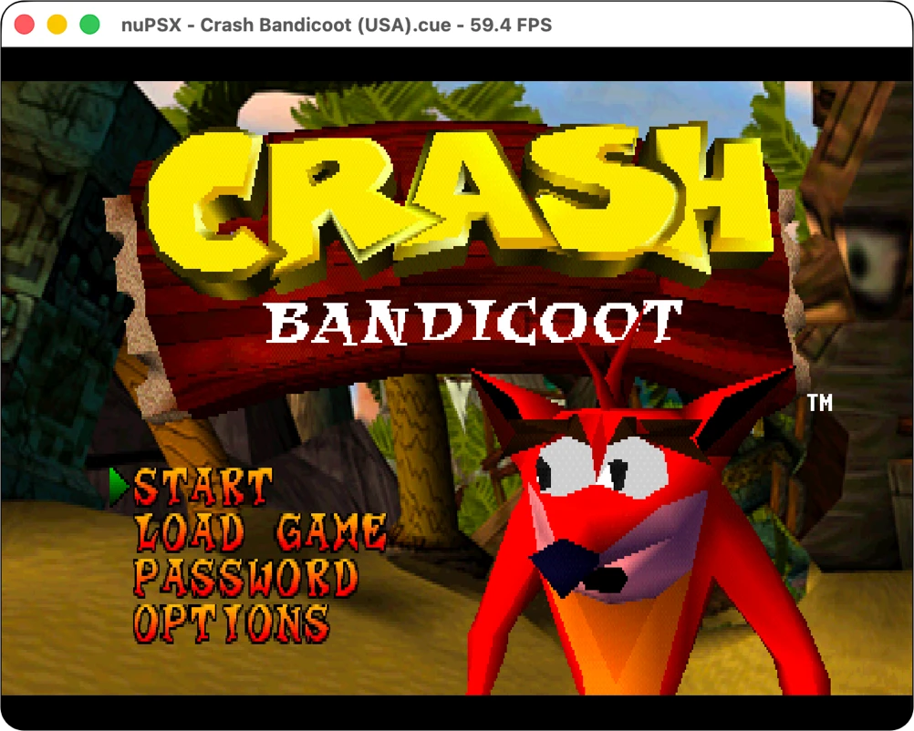
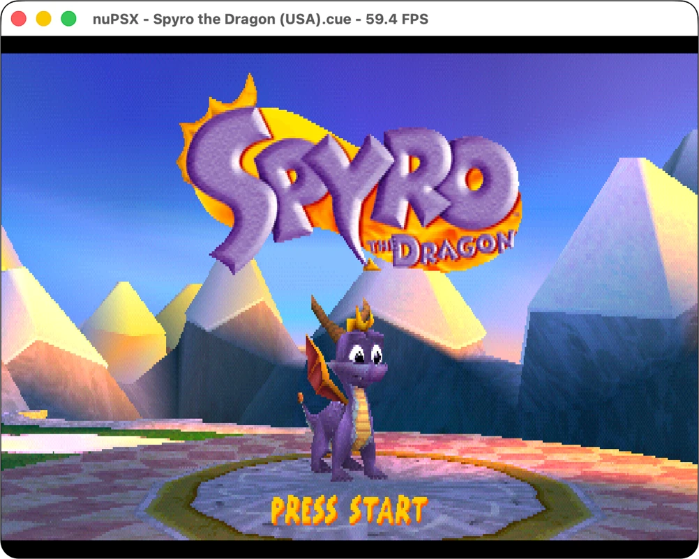
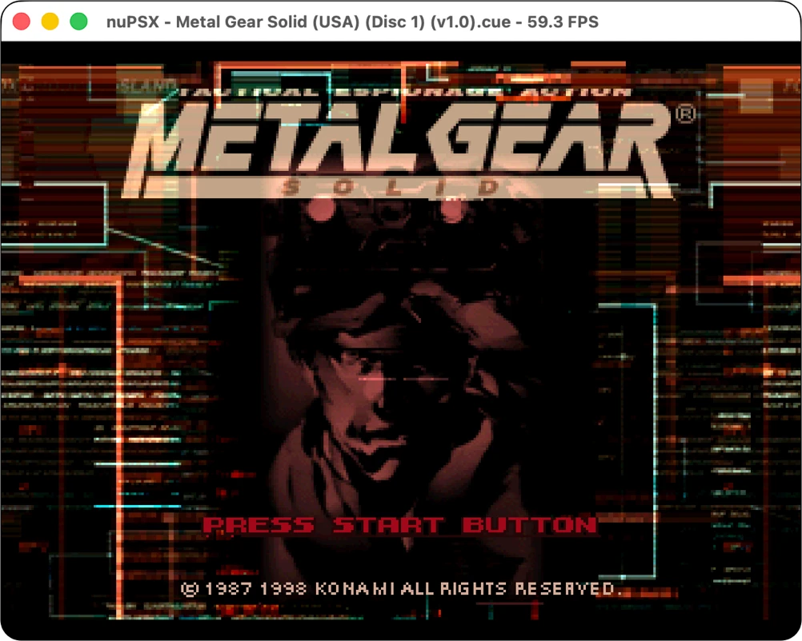
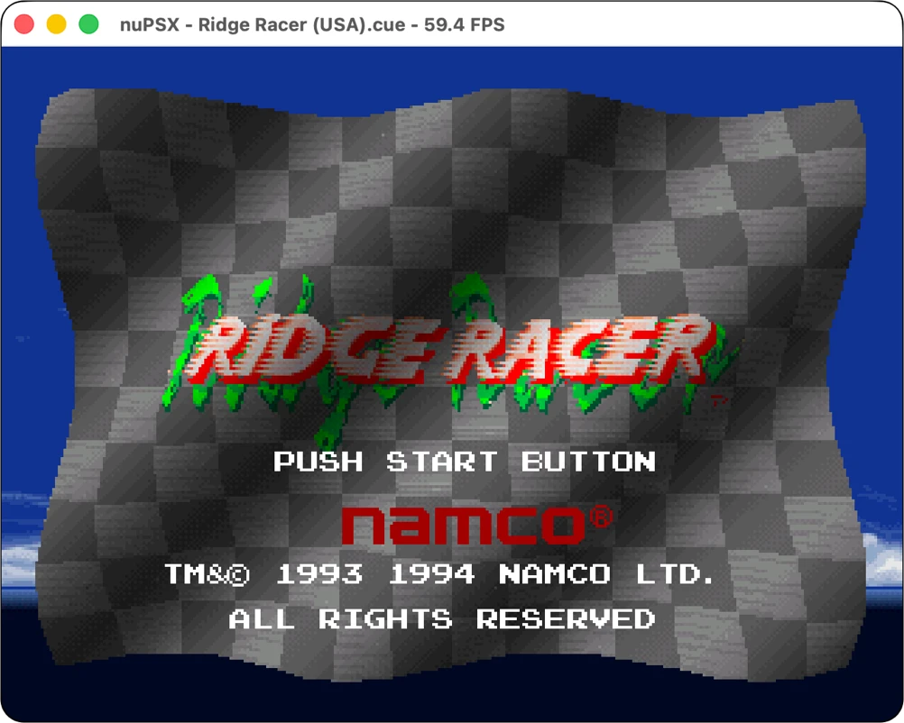

# nuPSX

nuPSX is an experimental PlayStation 1 emulator and debugger written in Zig, built as a learning exercise to explore Zig's capabilities and PSX hardware architecture. Still in early development with no intention of becoming usable by the general public. If you are looking for the emulator to play games, check out DuckStation.

<p>





</p>

## State

Can boot and play a few commercial games (notably Crash Bandicoot and MGS) and homebrew demos. Lots of things are still missing or incomplete. Tested 2D games are mostly fine, 3D games have minor graphical glitches. Sound system is not complete but functional enough to play music and most of sound effects in tested games.

|Game|Status|Issues|
|-|-|-|
|Battle Arena Toshinden|🟩 Playable||
|Colin McRae Rally|🟨 InGame||
|Colin McRae Rally 2.0|🟥 Nothing||
|Crash Bandicoot 2|🟨 InGame||
|Crash Bandicoot|🟩 Playable||
|Crash Bash|🟥 Nothing||
|Crash Team Racing|🟩 Playable|Sound (no voice)|
|Driver|🟩 Playable||
|Earthworm Jim 2|🟩 Playable||
|Final Fantasy VII|🟨 InGame||
|Gran Turismo|🟩 Playable||
|Grand Theft Auto|🟥 Nothing||
|Metal Gear Solid|🟩 Playable|Cutscene glitches|
|Mortal Kombat 2|🟩 Playable||
|Mortal Kombat 4|🟨 InGame|Screen resolution|
|Rayman|🟧 Intro||
|Rayman 2|🟨 InGame||
|Resident Evil 2|🟩 Playable||
|Ridge Racer|🟩 Playable||
|Silent Hill|🟨 InGame|Major sound issues|
|Spyro the Dragon|🟨 InGame|Major sound issues|
|Spyro Year of the Dragon|🟧 Intro||
|Star Ocean - The Second Story|🟨 InGame||
|Tekken 3|🟨 InGame|Screen resolution|
|Tom and Jerry in House Trap|🟩 Playable||
|Tomb Raider|🟧 Intro||
|Tomb Raider III|🟧 Intro||
|Wipeout|🟥 Nothing||

🟥 Nothing - Doesn't boot or crashes the emulator <br>
🟧 Intro - Boots into the title screen or main menu but doesn't get past it<br>
🟨 InGame - Boots into the game but has major issues<br>
🟩 Playable - Boots into the game with minor or no issues

## Download

Below are links to the latest prebuilt binaries. I don't have enough computers so not all of them are tested.

* [nupsx-aarch64-linux-gnu.zip](https://github.com/maxpoletaev/nupsx/releases/latest/download/nupsx-aarch64-linux-gnu.zip)
* [nupsx-x86_64-linux-gnu.zip](https://github.com/maxpoletaev/nupsx/releases/latest/download/nupsx-x86_64-linux-gnu.zip)
* [nupsx-aarch64-macos.zip](https://github.com/maxpoletaev/nupsx/releases/latest/download/nupsx-aarch64-macos.zip)
* [nupsx-x86_64-macos.zip](https://github.com/maxpoletaev/nupsx/releases/latest/download/nupsx-x86_64-macos.zip)
* [nupsx-x86_64-windows.zip](https://github.com/maxpoletaev/nupsx/releases/latest/download/nupsx-x86_64-windows.zip)

## Build & Run

```
git clone https://github.com/maxpoletaev/nupsx.git
cd nupsx
zig build --release=safe
./zig-out/bin/nupsx --bios SCPH1001.bin
```

## Command Line Options

```
nuPSX - A PlayStation emulator

Usage: nupsx --bios <path> [options]

Options:
  --bios <path>        Path to BIOS file (required)
  --exe <path>         Path to executable file to run
  --cdrom <path>       Path to CD-ROM image file (.cue)
  --debug              Enable debug user interface
  --disasm             Enable disassembly output
  --breakpoint <addr>  Set a breakpoint at the specified address (hexadecimal)
  -h, --help           Show this help message
```

## Controls

```
    [ Q ]                    [ O ]
  _/[ E ]\_       ┆┆       _/[ U ]\_
 /         \--------------/         \
|    [W]    |            |    [I]    |
| [A]   [D] |            | [J]   [L] |
|    [S]    | SHFT ENTR⟩ |    [K]    |
|\_________/--------------\_________/|
|       /                    \       |
|      /                      \      |
 \____/                        \____/

  ↑ = W     △ = I     [START]  = Enter
  ← = A     ◻ = J     [SELECT] = R-Shift
  ↓ = S     × = K     [L1] = E  [R1] = U
  → = D     ◯ = L     [L2] = Q  [R2] = O
```

## Dependencies

nuPSX relies on [zig-gamedev](https://github.com/zig-gamedev) libraries for graphics, audio and ImGui bindings.

## Credits

Special thanks to guys in [EmuDev Discord](https://discord.gg/dkmJAes) for sharing tons of undocumented knowledge and getting me unstuck countless times.

**Readings:**
 * [PSX-SPX Playstation Specifications](https://problemkaputt.de/psx-spx.htm) by Martin "nocash" Korth 
 * [PlayStation Emulation](https://jsgroth.dev/blog/posts/ps1-cpu/) blog post series by James Groth
 * [PlayStation Emulation Guide](https://github.com/simias/psx-guide) ([PDF](https://github.com/simias/psx-guide/issues/4#issuecomment-181339467)) by Lionel "simias" Flandrin
 * [The PS1 GPU texture pipeline and how to emulate it](https://www.reddit.com/r/EmuDev/comments/fmhtcn/article_the_ps1_gpu_texture_pipeline_and_how_to/) reddit post by an unknown author

**Tests and Demos:**
 * https://psx.amidog.se/doku.php
 * https://github.com/PeterLemon/PSX
 * https://github.com/JaCzekanski/ps1-tests

**Referenced Projects:**
 * https://github.com/allkern/psxe
 * https://github.com/stenzek/duckstation
 * https://github.com/JaCzekanski/Avocado
