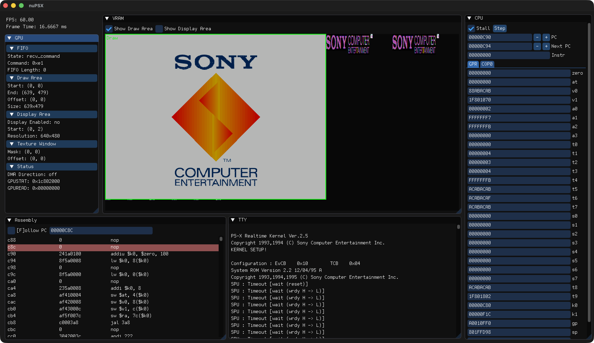
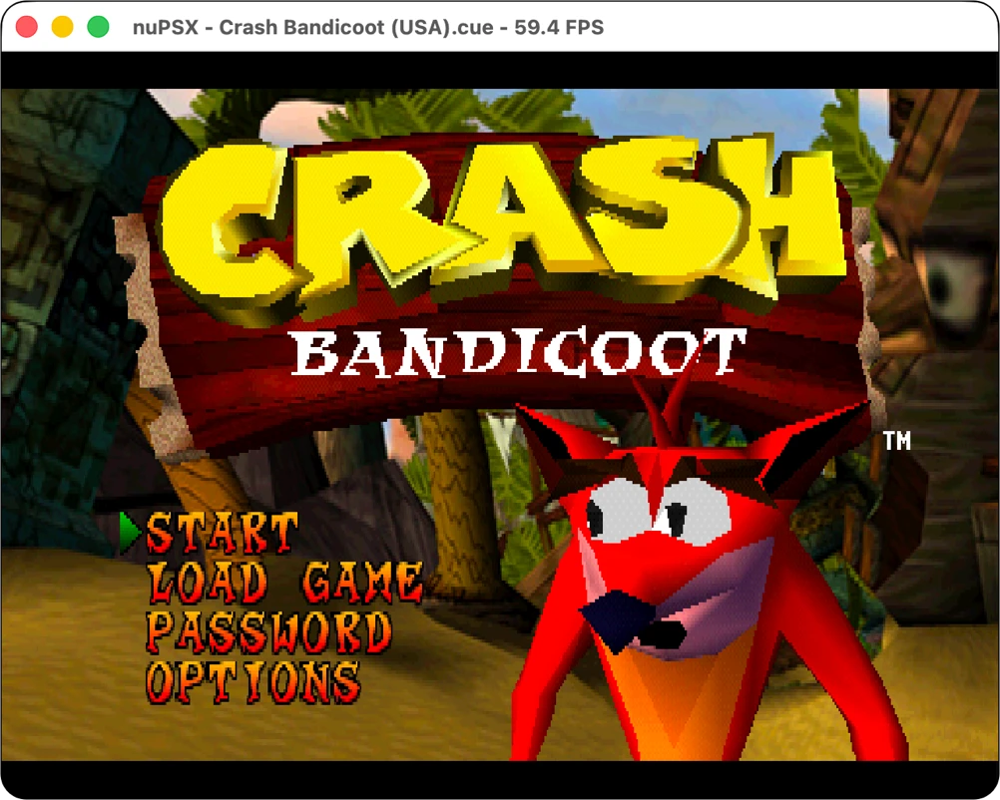
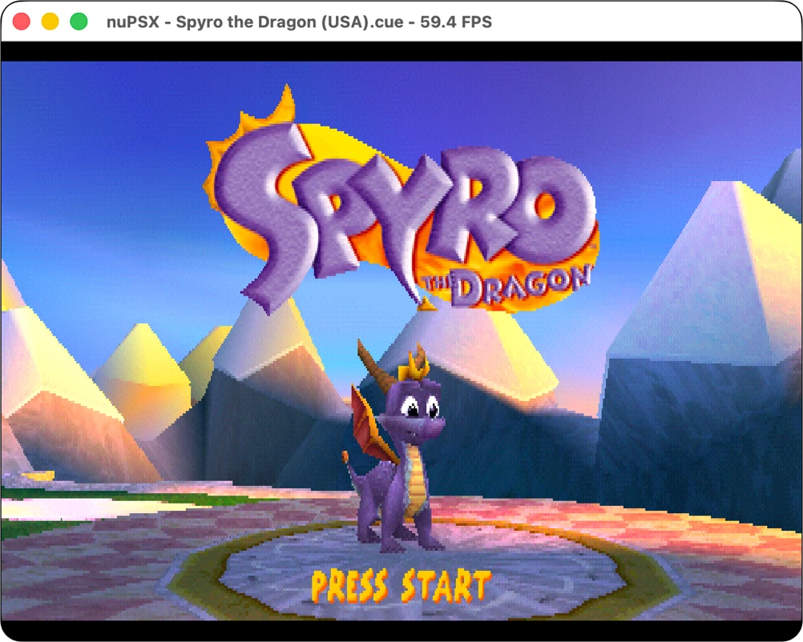
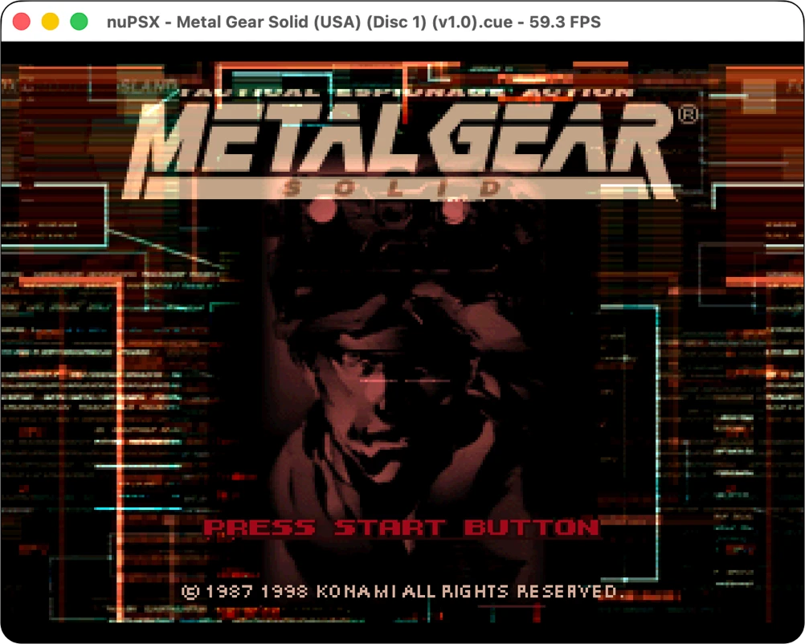
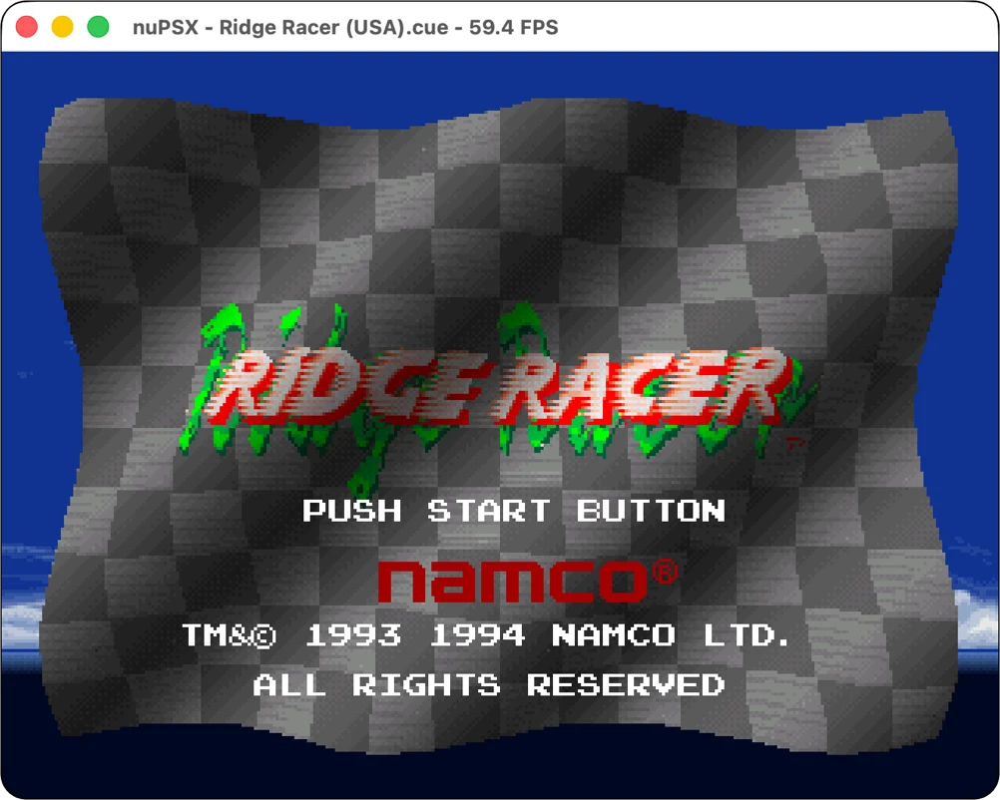

<p align="center"></p>

<hr>

**nuPSX** is an experimental PlayStation 1 emulator and debugger written in Zig, built as a learning exercise to explore Zig's capabilities and PSX hardware architecture. While I'm super proud of how far it has come, this is by no means an emulator that most would consider usable and complete. If you've come here for learning about emulation, this is probably a good project to dig into. If you are looking for the emulator to play games, better to check out DuckStation.

<p>





</p>

## State

Can boot and play lots of commercial games (notably Crash Bandicoot and MGS) and homebrew demos. Some things are still missing or incomplete. Tested 2D games are mostly fine, 3D games may have minor graphical glitches. Sound system lacks certain effects but is functional enough to play music and most of sound effects in tested games.

|Game|Status|Issues|
|-|-|-|
|Battle Arena Toshinden|🟩 Playable||
|Colin McRae Rally|🟩 Playable||
|Colin McRae Rally 2.0|🟩 Playable||
|Crash Bandicoot|🟩 Playable||
|Crash Bandicoot 2|🟩 Playable||
|Crash Bandicoot 3|🟩 Playable||
|Crash Bash|🟩 Playable||
|Crash Team Racing|🟩 Playable||
|Castlevania Symphony of the Night|🟨 InGame|Broken shading|
|Doom|🟨 InGame|Broken textures|
|Dino Crisis|🟨 InGame|Sound glitches|
|Driver|🟩 Playable||
|Earthworm Jim 2|🟩 Playable||
|Final Fantasy VII|🟨 InGame|Broken textures in menus/overlays|
|Frogger|🟩 Playable||
|Gran Turismo|🟩 Playable||
|Gran Turismo 2|🟥 Nothing||
|Grand Theft Auto|🟩 Playable||
|Metal Gear Solid|🟩 Playable||
|Mortal Kombat 2|🟩 Playable||
|Mortal Kombat 4|🟩 Playable||
|Legacy of Kain: Soul Reaver|🟨 InGame|Sound issues|
|Quake II|🟩 Playable||
|Rayman|🟧 Intro||
|Rayman 2|🟩 Playable||
|Resident Evil 2|🟩 Playable||
|Ridge Racer|🟩 Playable||
|Silent Hill|🟩 Playable||
|Spyro the Dragon|🟩 Playable|No background music|
|Spyro - Year of the Dragon|🟩 Playable||
|Spider Man 2|🟨 InGame|Badly broken geometry|
|Star Ocean - The Second Story|🟩 Playable||
|Tekken 3|🟨 InGame|Freezes after first round|
|Tom and Jerry in House Trap|🟩 Playable||
|Tomb Raider|🟨 InGame|No background sounds|
|Tomb Raider III|🟨 InGame|Incorrect shading|
|Tony Hawk's Pro Skater 2|🟨 InGame|Broken geometry|
|Wipeout|🟩 Playable||

🟥 Nothing - Doesn't boot or crashes the emulator <br>
🟧 Intro - Boots into the title screen or main menu but doesn't get past it<br>
🟨 InGame - Boots into the game but has major issues<br>
🟩 Playable - Boots into the game with minor or no issues

## Download

Below are links to the latest prebuilt binaries. I don't have enough computers so not all of them are tested.

* [nupsx-aarch64-linux-gnu.zip](https://github.com/maxpoletaev/nupsx/releases/latest/download/nupsx-aarch64-linux-gnu.zip)
* [nupsx-x86_64-linux-gnu.zip](https://github.com/maxpoletaev/nupsx/releases/latest/download/nupsx-x86_64-linux-gnu.zip)
* [nupsx-macos.dmg](https://github.com/maxpoletaev/nupsx/releases/latest/download/nupsx-macos.dmg) (universal)
* [nupsx-aarch64-macos.zip](https://github.com/maxpoletaev/nupsx/releases/latest/download/nupsx-aarch64-macos.zip)
* [nupsx-x86_64-macos.zip](https://github.com/maxpoletaev/nupsx/releases/latest/download/nupsx-x86_64-macos.zip)
* [nupsx-x86_64-windows.zip](https://github.com/maxpoletaev/nupsx/releases/latest/download/nupsx-x86_64-windows.zip)

> **Note for macOS users**: macOS will quarantine downloaded binaries by default. If you get a warning that the app is damaged or cannot be opened, remove the quarantine attribute with: `xattr -d com.apple.quarantine nupsx`

## Build & Run

```
git clone https://github.com/maxpoletaev/nupsx.git
cd nupsx
zig build --release=safe
./zig-out/bin/nupsx --bios SCPH1001.bin
```

## Command Line Options

```
nuPSX - A PlayStation emulator

Usage: nupsx --bios <path> [options]

Options:
  --bios <path>        Path to BIOS file (required)
  --exe <path>         Path to executable file to run
  --cdrom <path>       Path to CD-ROM image file (.cue)
  --memcard <path>     Path to memory card image (default: ~/.nupsx/memcard.mcd)
  --debug              Enable debug user interface
  --disasm             Enable disassembly output
  --breakpoint <addr>  Set a breakpoint at the specified address (hexadecimal)
  --uncapped           Run the emulator without frame rate limiting
  --no-shader          Disable the CRT/NTSC shader
  -h, --help           Show this help message
```

## Controls

```
    [ Q ]                    [ O ]
  _/[ E ]\_       ┆┆       _/[ U ]\_
 /         \--------------/         \
|    [W]    |            |    [I]    |
| [A]   [D] |            | [J]   [L] |
|    [S]    | SHFT ENTR⟩ |    [K]    |
|\_________/--------------\_________/|
|       /                    \       |
|      /                      \      |
 \____/                        \____/

  ↑ = W     △ = I     [START]  = Enter
  ← = A     ◻ = J     [SELECT] = R-Shift
  ↓ = S     × = K     [L1] = E  [R1] = U
  → = D     ◯ = L     [L2] = Q  [R2] = O
```

## Dependencies

nuPSX relies on [zig-gamedev](https://github.com/zig-gamedev) libraries for graphics, audio and ImGui bindings.

## Credits

Most of the knowledge comes from [PSX-SPX Playstation Specifications](https://problemkaputt.de/psx-spx.htm) by Martin "nocash" Korth.

Also special thanks to folks in [EmuDev Discord](https://discord.gg/dkmJAes) for sharing tons of undocumented knowledge and getting me unstuck countless times.

**Readings:**
 * [PlayStation Emulation](https://jsgroth.dev/blog/posts/ps1-cpu/) blog post series by James Groth
 * [PlayStation Emulation Guide](https://github.com/simias/psx-guide) ([PDF](https://github.com/simias/psx-guide/issues/4#issuecomment-181339467)) by Lionel "simias" Flandrin
 * [The PS1 GPU texture pipeline and how to emulate it](https://www.reddit.com/r/EmuDev/comments/fmhtcn/article_the_ps1_gpu_texture_pipeline_and_how_to/) reddit post by an unknown author

**Tests and Demos:**
 * https://psx.amidog.se/doku.php
 * https://github.com/PeterLemon/PSX
 * https://github.com/JaCzekanski/ps1-tests

**Referenced Projects:**
 * https://github.com/allkern/psxe
 * https://github.com/stenzek/duckstation
 * https://github.com/JaCzekanski/Avocado
 * https://github.com/allkern/iris (shaders)

